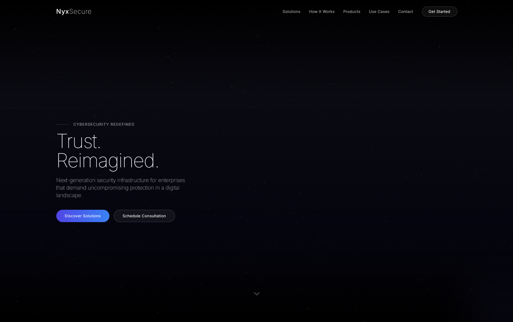
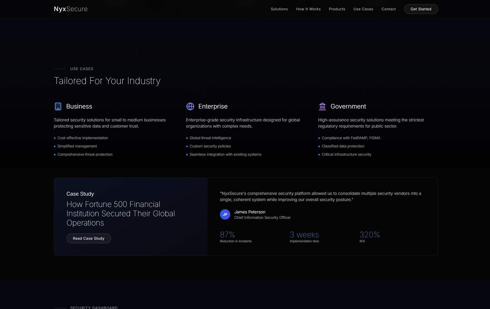
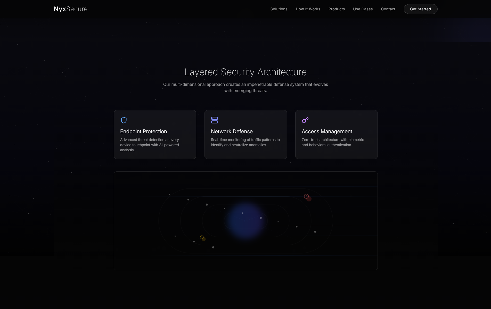

# 🛡️ NyxSecure – Premium Cybersecurity UI

**Minimal. Intelligent. Secure. Elegant.**

NyxSecure is a concept cybersecurity platform interface designed for the future of high-trust digital defense. Inspired by Apple, Tesla, and modern luxury brands, it delivers a visually refined and ultra-secure digital experience.

---

## ✨ Features

- 🖤 Ultra-minimalist dark interface with neural motion backgrounds
- 🧠 Animated data flows and encrypted layers
- 🔐 Modular security suite cards with 3D transitions
- 📊 Live dashboard mockup with AI alerts and access logs
- 🧬 Particle effects and reactive bloom for cyber-futuristic feel
- 🎯 Soft hover microinteractions with Framer Motion
- 🧾 Contact & onboarding forms with glassmorphic UI

---

## 📸 Screenshots

  
  
  

---

## 🧪 Tech Stack

- ⚛️ React + Vite
- 💨 TailwindCSS for elegant utility-first styling
- 🎞️ Framer Motion for smooth animations
- 🧱 Modular components
- ✨ Particle FX + blur-based depth layers

---

## 📁 Project Structure

```
components/
├── ui/
│   ├── SecurityCard.tsx         # Suite product card (glassmorphic)
│   └── ParticleBackground.tsx   # Floating particle effects
├── Hero.tsx                     # Hero tagline + animation
├── DashboardPreview.tsx         # Mockup of live dashboard
├── ProductSuite.tsx             # Endpoint / Cloud / Identity modules
├── UseCases.tsx                 # Business / Enterprise / Gov blocks
├── ContactForm.tsx              # Elegant dark form with steps
├── Footer.tsx
App.tsx
index.css
tailwind.config.js
```

---

## 🚀 Getting Started

```bash
git clone https://github.com/yourusername/nyxsecure-ui.git
cd nyxsecure-ui
npm install
npm run dev
```

---